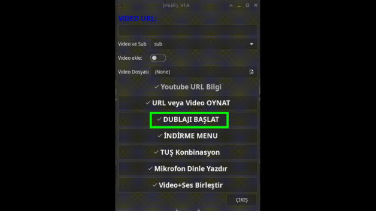
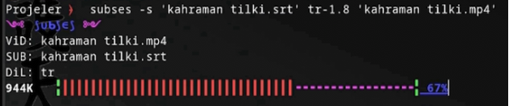
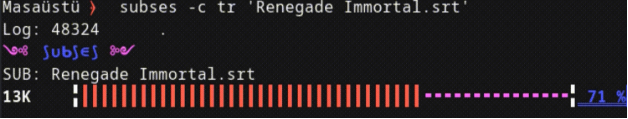
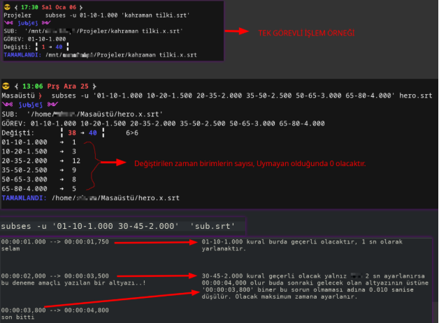

This is an application written for watching dubbed subtitles.

Subtitle errors or editing can be done.

It creates temporary files in /tmp/ses and then deletes them. 

Google URLs are used in translation and audio recognition.

Errors that can be identified in the subtitles are reported. 

There may be a formatting problem in srt files with unidentified errors. 

Performance depends on the srt quality.

-s  

The process of converting subtitles to audio files.

`subses -s 'video.srt' tr-1.5 'video.mp4'`

-m 

Converting text to audio file

`subses -m tr 'Hello boys' 'ses.mp3'`

-b

Splitting video and subtitles synchronously

`subses -b 'srt.mp4' 'srt.srt' 00:01:00`

-z

Changing subtitle timing settings

advanced adjustment

`subses -z +1.000 'srt.srt'`

back subtitle time setting

`subses -z -1.500 'srt.srt'`

-c

subtitle a simple translation feature.

`subses -c tr 'Renegade Immortal.srt'`

-k

The text-to-speech process can also be timed.

`subses -k tr 1.2 'Hello boys'`

Wait 3 seconds.

`subses -k -3 tr 1.5 'Hello boys'`

-i

OCR text recognition and speech processing works in the specified language.

It works by assigning a key combination.

-t

A simple translation process.

`subses -t tr 'hello boys'`

OR

`echo 'Hello boy' | subses -t tr`

-u

Subtitle interval time adjustments and error corrections are made.

------------------------------------------------------------

Place these files in this path.

$HOME/.config/subses/dil.log

$HOME/.config/subses/subses.png

Link containing video examples of how to use it.

https://www.youtube.com/watch?v=MJqDyuQW59E

